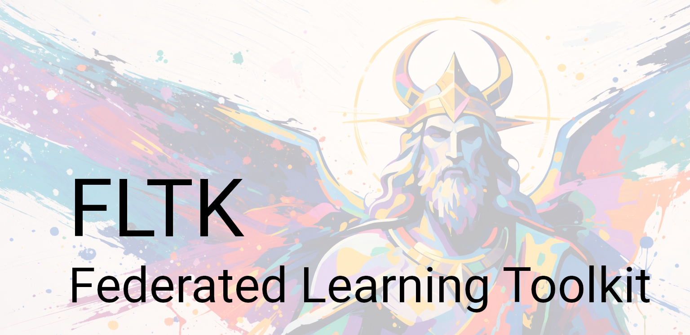

# FLTK - Federated Learning Toolkit

[](LICENSE)
[](https://www.python.org/downloads/release/python-370/)
[](https://www.python.org/downloads/release/python-380/)


This repository contains the code and experiments for the paper:
> [Aergia: leveraging heterogeneity in federated learning systems](https://dl.acm.org/doi/abs/10.1145/3528535.3565238)
>
> [Middleware 2022](https://middleware-conf.github.io/2022/)

If you find this code useful in your research, please consider citing:
```bibtex
@inproceedings{10.1145/3528535.3565238,
    author = {Cox, Bart and Chen, Lydia Y. and Decouchant, J\'{e}r\'{e}mie},
    title = {Aergia: Leveraging Heterogeneity in Federated Learning Systems},
    year = {2022},
    isbn = {9781450393409},
    publisher = {Association for Computing Machinery},
    address = {New York, NY, USA},
    url = {https://doi.org/10.1145/3528535.3565238},
    doi = {10.1145/3528535.3565238},
    booktitle = {Proceedings of the 23rd ACM/IFIP International Middleware Conference},
    pages = {107–120},
    numpages = {14},
    keywords = {task offloading, federated learning, stragglers},
    location = {Quebec, QC, Canada},
    series = {Middleware '22}
}
```

This toolkit is can be used to run Federated Learning experiments.
Pytorch Distributed ([docs](https://pytorch.org/tutorials/beginner/dist_overview.html)) is used in this project.
The goal if this project is to launch Federated Learning nodes in truly distribution fashion.

FLTK is a research-oriented toolkit for designing and running **Federated Learning (FL)** experiments.
It is built on top of **PyTorch Distributed** ([documentation](https://pytorch.org/tutorials/beginner/dist_overview.html)) and is designed to support *truly distributed* federated systems.

The toolkit has been tested on **Ubuntu 20.04** with **Python 3.7 and 3.8**.

---

## Design overview

PyTorch Distributed operates using a **world size** and **process ranks**, where ranks range from `0` to `world_size - 1`.
In FLTK:

* Rank `0` is typically assigned to the **federator (server)**
* Ranks `1` to `world_size - 1` correspond to **clients**

### Federated learning protocol

A typical FL round proceeds as follows:

1. Client selection by the federator
2. Selected clients download the current global model
3. Local training on clients for a fixed number of epochs
4. Clients send model updates (weights or gradients) to the federator
5. The federator aggregates the updates to produce a new global model
6. The updated model is redistributed to clients
7. Steps 1–6 are repeated until convergence

### Key assumptions and constraints

* Client data is **never shared**
* Client data distributions are **non-IID**
* Client hardware can be **heterogeneous**
* Device location affects communication latency and bandwidth
* Communication overhead can be significant

---

## Project structure

Overview of the main directories and files:

```
project
├── experiments
├── deploy                                    # Templates for automatic deployment
│     └── docker                              # Docker-based system deployment
│          ├── stub_default.yml
│          └── system_stub.yml                # Defines the federator and network
├── fltk                                      # Source code
│     ├── core                                # Core abstractions
│     ├── datasets                            # Dataset definitions
│     │    ├── data_distribution              # Distributed datasets and samplers
│     │    └── distributed                    # Centralized dataset variants
│     ├── nets                                # Model architectures
│     ├── samplers                            # Non-IID data samplers
│     ├── schedulers                          # Learning rate schedulers
│     ├── strategy                            # Client selection and aggregation
│     ├── util                                # Utility functions
│     └── __main__.py                         # Package entry point
├── Dockerfile                                # Container definition
├── LICENSE
├── README.md
└── setup.py
```

---

## Execution modes

FLTK supports multiple execution modes depending on experimental requirements.

### Simulation

All nodes (federator and clients) run on a **single machine** in a sequential manner.
This mode is convenient for debugging and supports **GPU acceleration**, but does not capture real-time interaction effects.

### Docker Compose (Emulation)

Each node runs in its own Docker container, with configurable CPU, memory, and network constraints.
This mode enables **real-time experiments** where client execution timing and resource contention matter, while remaining reproducible on a single machine.

### Fully distributed (e.g., Google Cloud)

Nodes are deployed natively across multiple physical or virtual machines.
This mode most closely resembles real-world FL deployments, but requires substantial infrastructure and makes resource control more difficult.

### Hybrid

Docker-based emulation and native deployments can be combined.
For example, multiple servers may each run several Docker containers that participate in a single federated system.

---

## Supported models

* CIFAR-10 CNN
* CIFAR-10 ResNet
* CIFAR-100 ResNet
* CIFAR-100 VGG
* Fashion-MNIST CNN
* Fashion-MNIST ResNet
* Reddit LSTM
* Shakespeare LSTM

---

## Supported datasets

* CIFAR-10
* CIFAR-100
* Fashion-MNIST
* MNIST
* Shakespeare

---

## Prerequisites

For Docker-based execution:

* Docker
* Docker Compose

---

## Installation

```bash
python3 -m pip install -r requirements.txt
```

### Load default models

```bash
python3 -m fltk.util.default_models
```

---

## Examples

<details><summary>Show examples</summary>

### Docker Compose

**Note:** Ensure that `docker` and `docker compose` are installed.

Generate Docker configuration:

```bash
python3 -m fltk util-generate experiments/example_docker/
```

Run an example experiment:

```bash
python3 -m fltk util-run experiments/example_docker/
```

---

### Single machine (native)

#### Launch federator

```bash
python3 -m fltk single configs/experiment.yaml --rank=0
```

#### Launch client

```bash
python3 -m fltk single configs/experiment.yaml --rank=1
```

</details>

---

## Known issues

<<<<<<< HEAD
* GPU support is currently unavailable in Docker and Docker Compose
* The first training epoch can be significantly slower (6×–8×)
=======
* Currently, there is no GPU support docker containers (or docker compose)
* First epoch only can be slow (6x - 8x slower)
>>>>>>> feeb1cfdfeea3a09c141d494ec9c184e758b73fa
